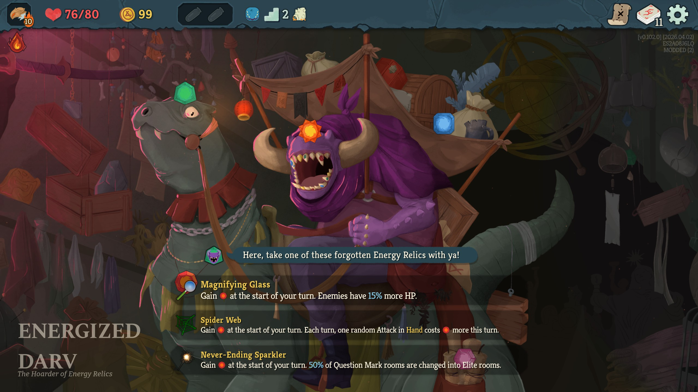
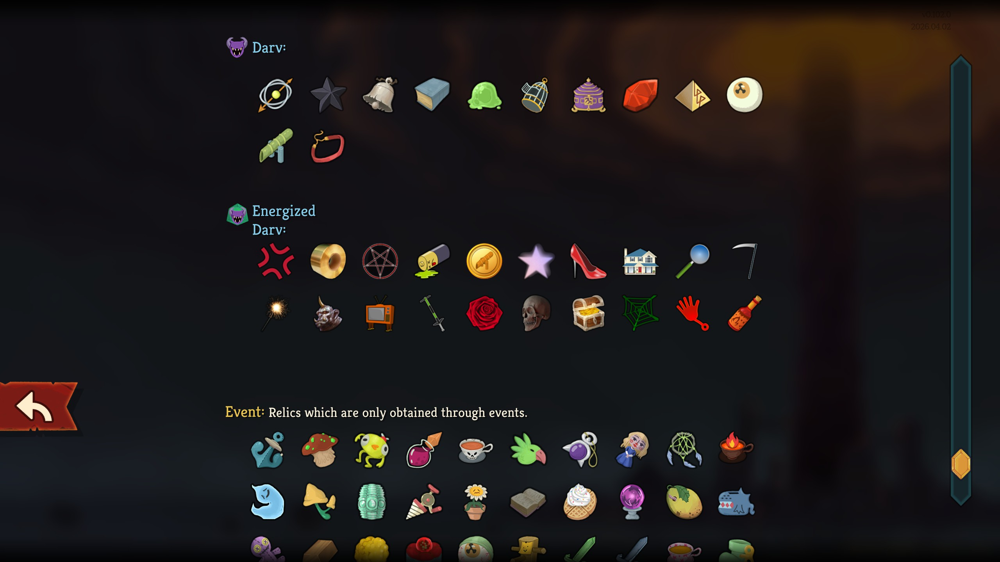

# Energized Spire 2.0

## 📄 Description

This mod introduces a new Ancient, **Energized Darv**, who can appear in Act 2 or Act 3 and offers a selection of Energy Relics. Each relic grants additional Energy but comes with a drawback, similar to how Energy Relics function in the base game.

Each base-game character has two character-specific relics, and there are 10 shared relics.

This mod should work properly in multiplayer. In case of any problems, please report them and include the logs (%APPDATA%\SlayTheSpire2\logs\godot.log file) if possible.

## 🌐 Localization
The mod is available in:
- English
- Simplified Chinese (thanks to OLC and Mantodea)
- Korean (thanks to snumodder)

## 📦 Dependencies
- BaseLib version 3.2.0 or newer.

## ⚙️ Installation
1. Go to the [Releases](https://github.com/JohnnyBazooka89/StS2ModEnergizedSpire2/releases) page on GitHub and download the latest version.
2. Extract the ZIP file.
3. Navigate to your *Slay the Spire 2* installation folder: `{SteamLibrary}\steamapps\common\Slay The Spire 2`
4. If the `mods` folder does not exist, create it.
5. Move the `EnergizedSpire2` folder into the `mods` folder.

## 🖼️ Screenshots

## List of all relics:
| Character      | Relic Name           | Effect                                                                                                                                                                                             | Notes                                                |
|----------------|----------------------|----------------------------------------------------------------------------------------------------------------------------------------------------------------------------------------------------|------------------------------------------------------|
| Ironclad       | Rotting Skull        | If your HP is at or below 50%, gain [E] and draw 1 additional card at the start of each turn.                                                                                                      | -                                                    |
| Ironclad       | Tabasco Sauce        | Gain [E] at the start of each turn. Healing effects are reduced by 50%.                                                                                                                            | -                                                    |
| Silent         | High Heels           | Gain [E] at the start of each turn. At the start of combat, lose 1 Dexterity and shuffle 1 Clumsy into your draw pile.                                                                             | -                                                    |
| Silent         | Pogo Stick           | Gain [E] at the start of each turn. The first time each turn you discard a card, shuffle 1 Dazed into your draw pile.                                                                              | -                                                    |
| Defect         | Old TV               | Gain [E] at the start of each turn. At the start of combat, shuffle 1 Reception Problems into your draw pile. Reception Problems: Unplayable. Whenever this card is drawn, lose 2 Focus this turn. | -                                                    |
| Defect         | Aggression Protocol  | Gain [E] at the start of each turn. While you have an Attack in hand, the first Skill or Power card you play each turn costs [E] more.                                                             | -                                                    |
| Regent         | Fading Constellation | At the start of each turn, gain [E] and lose 1 Star.                                                                                                                                               | -                                                    |
| Regent         | Royal Coffers        | If you have at least 300 unspent Gold, gain [E] at the start of each turn.                                                                                                                         | -                                                    |
| Necrobinder    | Brass Coil           | Gain [E] at the start of each turn. Enemies start combat with 1 Artifact. In single-enemy combats, the enemy gains 2 Artifact instead.                                                             | Filtered out in Multiplayer                          |
| Necrobinder    | Necrotic Scythe      | The first time each turn you play a card that costs 2 [E] or more, gain [E].                                                                                                                       | -                                                    |
| All characters | Cursed Pentagram     | Gain [E] at the start of each turn. Obtain a Curse for every 5 future non-Curse cards added to your deck.                                                                                          | Available only in Act 2                              |
| All characters | Dead Battery         | Gain [E] at the start of each turn. You cannot play more than 1 Power card per turn.                                                                                                               | Available only in Act 3                              |
| All characters | Energized Coin       | Gain [E] at the start of each turn. Whenever you climb a floor, Energized Coin is rerolled to have the negative effect of either Sozu or Ectoplasm.                                                | Available only in Act 2                              |
| All characters | Huge House           | Gain [E] at the start of each turn. Upon pickup: lose 1 random potion, lose 50 Gold, lower Max HP by 5, obtain 1 Strike, downgrade 1 random card.                                                  | -                                                    |
| All characters | Magnifying Glass     | Gain [E] at the start of each turn. Enemies have 15% more HP.                                                                                                                                      | Filtered out in Multiplayer                          |
| All characters | Never-Ending Sparkler| Gain [E] at the start of each turn. 50% of Question Mark rooms are changed into Elite rooms.                                                                                                       | Filtered out in Multiplayer                          |
| All characters | Ogre Head            | Gain [E] at the start of each turn. Whenever you play a card that targets an enemy, you have a 50% chance to target another enemy.                                                                 | -                                                    |
| All characters | Red Rose             | Gain [E] at the start of each turn. All enemies start combat with 1 Thorns.                                                                                                                        | Available only in Act 3; Filtered out in Multiplayer |
| All characters | Spider Web           | Gain [E] at the start of each turn. Each turn, one random Attack in Hand becomes Entangled this turn.                                                                                              | -                                                    |
| All characters | Sticky Hand          | Gain [E] at the start of each turn. Whenever you would take a card in a future card reward, you take ALL the offered cards instead.                                                                | -                                                    |

## 🤝 Contact
If you run into any issues or have suggestions for balance changes, feel free to reach out on the official Slay the Spire 2 Discord (nickname: JohnnyBazooka89).